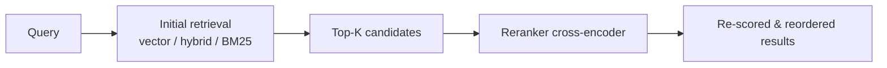

Reranker modules apply a second-pass scoring step to results returned by an initial vector, keyword, or hybrid search. An initial retrieval returns candidate results quickly using approximate methods. The reranker then scores each candidate against the query using a more precise cross-encoder model and returns results in the new order.



The trade-off: reranking increases latency proportional to the number of candidates and the model size, but significantly improves precision — especially when initial retrieval uses approximate nearest neighbor search.

## Available rerankers

<Tabs>
  <Tab title="Cloud APIs">
    | Module | Provider | API key env var |
    |--------|----------|-----------------|
    | `reranker-cohere` | Cohere | `COHERE_APIKEY` |
    | `reranker-jinaai` | Jina AI | `JINAAI_APIKEY` |
    | `reranker-voyageai` | Voyage AI | `VOYAGEAI_APIKEY` |
    | `reranker-nvidia` | NVIDIA | `NVIDIA_APIKEY` |
    | `reranker-contextualai` | Contextual AI | `CONTEXTUALAI_APIKEY` |

    Cloud rerankers call an external API for each reranking request. They require no additional infrastructure but add network round-trip latency.
  </Tab>
  <Tab title="Self-hosted">
    | Module | Description | Config |
    |--------|-------------|--------|
    | `reranker-transformers` | Run any cross-encoder model locally using HuggingFace Transformers | `RERANKER_INFERENCE_API` |

    Self-hosted rerankers run inside your own infrastructure. They eliminate external API calls and are suitable for air-gapped environments or workloads with strict data residency requirements.

    Deploy the inference container alongside Weaviate:

    ```yaml
    services:
      weaviate:
        image: cr.weaviate.io/semitechnologies/weaviate:latest
        environment:
          ENABLE_MODULES: text2vec-transformers,reranker-transformers
          TRANSFORMERS_INFERENCE_API: http://t2v-transformers:8080
          RERANKER_INFERENCE_API: http://reranker-transformers:8080
      t2v-transformers:
        image: cr.weaviate.io/semitechnologies/transformers-inference:sentence-transformers-multi-qa-MiniLM-L6-cos-v1
      reranker-transformers:
        image: cr.weaviate.io/semitechnologies/reranker-transformers:cross-encoder-ms-marco-MiniLM-L-6-v2
    ```
  </Tab>
</Tabs>

## Enabling a reranker module

Add the reranker module to `ENABLE_MODULES` when starting Weaviate:

```bash
docker run -p 8080:8080 -p 50051:50051 \
  -e ENABLE_MODULES=text2vec-cohere,reranker-cohere \
  -e COHERE_APIKEY=... \
  cr.weaviate.io/semitechnologies/weaviate:latest
```

## Configuring a reranker per collection

Specify the reranker module when you create a collection. This sets the default reranker for all queries on that collection.

```python
import weaviate
from weaviate.classes.config import Configure

client = weaviate.connect_to_local()

client.collections.create(
    name="Article",
    vector_config=Configure.Vectors.text2vec_cohere(),
    reranker_config=Configure.Reranker.cohere(
        model="rerank-english-v3.0",
    ),
)
```

### Cohere reranker

```python
reranker_config=Configure.Reranker.cohere(
    model="rerank-english-v3.0",
)
```

### Jina AI reranker

```python
reranker_config=Configure.Reranker.jinaai(
    model="jina-reranker-v2-base-multilingual",
)
```

### Voyage AI reranker

```python
reranker_config=Configure.Reranker.voyageai(
    model="rerank-2",
)
```

### Self-hosted Transformers reranker

```python
reranker_config=Configure.Reranker.transformers()
```

## Using reranking in queries

Add a `rerank` parameter to any search query. Specify which property to use as the reranking input — this is the text the cross-encoder scores against the query.

### Rerank after vector search

```python
from weaviate.classes.query import Rerank

articles = client.collections.get("Article")

response = articles.query.near_text(
    query="climate change effects on agriculture",
    limit=10,
    rerank=Rerank(
        prop="body",
        query="climate change effects on agriculture",
    ),
)

for obj in response.objects:
    print(obj.properties["title"], obj.metadata.rerank_score)
```

### Rerank after hybrid search

```python
response = articles.query.hybrid(
    query="renewable energy policy",
    alpha=0.5,
    limit=20,
    rerank=Rerank(
        prop="body",
        query="renewable energy policy",
    ),
)
```

The `limit` in the initial query controls how many candidates the reranker scores. Fetch more candidates than you need (e.g., `limit=20`) and rely on the reranker to surface the best results.

## Performance considerations

Reranking adds a synchronous round-trip to the embedding model or API for each candidate. Consider these factors:

- **Candidate count**: Reranking 20 objects takes roughly 2× the time of reranking 10. Limit initial retrieval to a reasonable candidate pool (typically 10–50).
- **Model size**: Larger cross-encoders are more accurate but slower. For low-latency use cases, use a smaller model such as `cross-encoder-ms-marco-MiniLM-L-6-v2`.
- **Cloud vs. self-hosted**: Cloud API rerankers have network latency but scale automatically. Self-hosted rerankers have predictable latency but require you to manage capacity.
- **Precision gain**: Cross-encoder reranking consistently outperforms bi-encoder retrieval alone on relevance benchmarks, particularly for longer queries and long-tail topics.

<Tip>
  A common pattern is to retrieve a larger candidate set (e.g., `limit=50`) with fast hybrid search, then rerank to the final top-5 or top-10. This gives the reranker enough candidates to work with while keeping the final result set small.
</Tip>

## Related pages

<CardGroup cols={2}>
  <Card title="Reranking search guide" icon="arrow-up-down" href="/search/reranking">
    Step-by-step guide to writing reranking queries.
  </Card>
  <Card title="Hybrid search" icon="magnifying-glass" href="/search/hybrid-search">
    Combine vector and BM25 search before reranking.
  </Card>
  <Card title="Generative modules" icon="robot" href="/modules/generative">
    Chain reranking with RAG for high-precision generation.
  </Card>
  <Card title="Vectorizer modules" icon="plug" href="/modules/vectorizers">
    Configure the embedding model used for initial retrieval.
  </Card>
</CardGroup>
